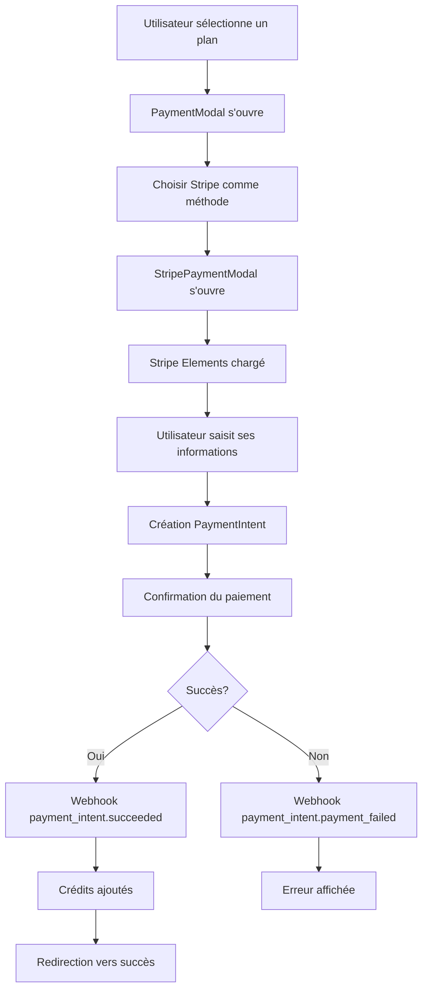

# Intégration Stripe - Guide de Configuration

## 🚀 Installation et Configuration

### 1. Variables d'Environnement

Créez un fichier `.env` à la racine du projet avec les clés Stripe :

```env
# Stripe Configuration
VITE_STRIPE_PUBLISHABLE_KEY=pk_test_your_publishable_key_here
VITE_STRIPE_SECRET_KEY=sk_test_your_secret_key_here
VITE_STRIPE_WEBHOOK_SECRET=whsec_your_webhook_secret_here

# Application Configuration
VITE_APP_URL=http://localhost:5173
VITE_API_URL=http://localhost:3000/api

# Currency Configuration
VITE_DEFAULT_CURRENCY=XAF
```

### 2. Obtenir les Clés Stripe

1. **Créer un compte Stripe** : https://stripe.com
2. **Récupérer les clés** :
   - Clé publique : Dashboard → Developers → API keys → Publishable key
   - Clé secrète : Dashboard → Developers → API keys → Secret key
   - Webhook secret : Dashboard → Developers → Webhooks → Endpoint secret

### 3. Configuration du Webhook

1. **Créer un endpoint webhook** dans le dashboard Stripe
2. **URL** : `https://votre-domaine.com/api/webhooks/stripe`
3. **Événements à écouter** :
   - `payment_intent.succeeded`
   - `payment_intent.payment_failed`
   - `payment_intent.canceled`
   - `charge.dispute.created`

## 🏗️ Architecture

### Composants Principaux

- **`StripeProvider`** : Provider React pour Stripe Elements
- **`StripePaymentModal`** : Modal de paiement avec Stripe Elements
- **`StripeService`** : Service pour les appels API Stripe
- **`useStripePayment`** : Hook personnalisé pour les paiements
- **`StripeWebhookHandler`** : Gestionnaire de webhooks

### Flux de Paiement



## 🔧 API Backend Requise

### Endpoints Nécessaires

```typescript
// POST /api/create-payment-intent
interface CreatePaymentIntentRequest {
  amount: number;
  currency: string;
  metadata: {
    planId: string;
    userId: string;
    planName: string;
  };
}

// GET /api/payment-methods/:customerId
// POST /api/create-customer
// POST /api/refund-payment
// GET /api/payment-status/:paymentIntentId
// POST /api/webhooks/stripe
```

### Exemple d'implémentation (Node.js/Express)

```javascript
const stripe = require('stripe')(process.env.STRIPE_SECRET_KEY);

// Créer un PaymentIntent
app.post('/api/create-payment-intent', async (req, res) => {
  try {
    const { amount, currency, metadata } = req.body;
    
    const paymentIntent = await stripe.paymentIntents.create({
      amount,
      currency,
      metadata,
      automatic_payment_methods: {
        enabled: true,
      },
    });

    res.json({ paymentIntent });
  } catch (error) {
    res.status(500).json({ error: error.message });
  }
});

// Webhook Stripe
app.post('/api/webhooks/stripe', express.raw({type: 'application/json'}), (req, res) => {
  const sig = req.headers['stripe-signature'];
  const endpointSecret = process.env.STRIPE_WEBHOOK_SECRET;

  let event;
  try {
    event = stripe.webhooks.constructEvent(req.body, sig, endpointSecret);
  } catch (err) {
    return res.status(400).send(`Webhook signature verification failed.`);
  }

  // Traiter l'événement
  switch (event.type) {
    case 'payment_intent.succeeded':
      // Mettre à jour les crédits de l'utilisateur
      break;
    case 'payment_intent.payment_failed':
      // Gérer l'échec
      break;
  }

  res.json({received: true});
});
```

## 🧪 Test de l'Intégration

### Cartes de Test Stripe

- **Succès** : `4242 4242 4242 4242`
- **Échec** : `4000 0000 0000 0002`
- **3D Secure** : `4000 0025 0000 3155`
- **Date d'expiration** : N'importe quelle date future
- **CVC** : N'importe quel code à 3 chiffres

### Commandes de Test

```bash
# Installer les dépendances
npm install

# Démarrer en mode développement
npm run dev

# Tester avec les cartes de test
# Ouvrir http://localhost:5173/plans
# Sélectionner un plan et tester le paiement
```

## 🔒 Sécurité

### Bonnes Pratiques

1. **Ne jamais exposer la clé secrète** côté client
2. **Valider les webhooks** avec la signature Stripe
3. **Utiliser HTTPS** en production
4. **Chiffrer les données sensibles** en base
5. **Implémenter la validation 3D Secure**

### Variables d'Environnement

```bash
# Production
VITE_STRIPE_PUBLISHABLE_KEY=pk_live_...
VITE_STRIPE_SECRET_KEY=sk_live_... # Côté serveur uniquement
VITE_STRIPE_WEBHOOK_SECRET=whsec_...

# Test
VITE_STRIPE_PUBLISHABLE_KEY=pk_test_...
VITE_STRIPE_SECRET_KEY=sk_test_... # Côté serveur uniquement
VITE_STRIPE_WEBHOOK_SECRET=whsec_...
```

## 🐛 Dépannage

### Problèmes Courants

1. **"Stripe non initialisé"**
   - Vérifier que `VITE_STRIPE_PUBLISHABLE_KEY` est définie
   - Vérifier que la clé commence par `pk_`

2. **"Configuration Stripe manquante"**
   - Vérifier toutes les variables d'environnement
   - Redémarrer le serveur de développement

3. **Erreurs de paiement**
   - Vérifier les logs de la console
   - Utiliser les cartes de test Stripe
   - Vérifier la configuration du webhook

### Logs de Debug

```javascript
// Activer les logs Stripe
console.log('Stripe config:', STRIPE_CONFIG);
console.log('Payment intent:', paymentIntent);
console.log('Webhook event:', event);
```

## 📚 Ressources

- [Documentation Stripe](https://stripe.com/docs)
- [Stripe Elements](https://stripe.com/docs/stripe-js/react)
- [Webhooks Stripe](https://stripe.com/docs/webhooks)
- [Test Cards](https://stripe.com/docs/testing)

